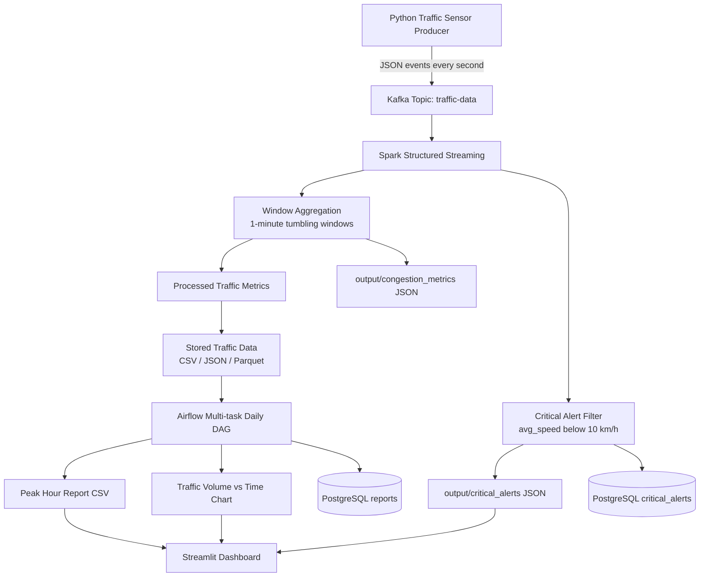

# Smart City Traffic & Congestion System Architecture

## Components

- **Producer:** `producer/traffic_producer.py` simulates four Colombo junction sensors and publishes JSON records to Kafka.
- **Kafka:** `traffic-data` is the event-streaming topic used between ingestion and stream processing.
- **Spark Structured Streaming:** `spark/traffic_stream_processor.py` consumes Kafka records, parses JSON, detects congestion, and performs windowed aggregation.
- **Alert Storage:** critical alerts are written to `output/critical_alerts` as JSON and can also be written to PostgreSQL.
- **PostgreSQL:** `postgres:14.20-trixie` stores report tables and optional real-time alert records.
- **Airflow DAG:** `airflow/dags/daily_traffic_report.py` schedules a multi-task daily analytical workflow.
- **Reports:** `reports/daily_peak_report.csv` and `reports/traffic_volume_chart.png` are generated from stored traffic data.
- **Dashboard:** `dashboard/traffic_dashboard.py` displays reports, hourly congestion, charts, and alerts.
